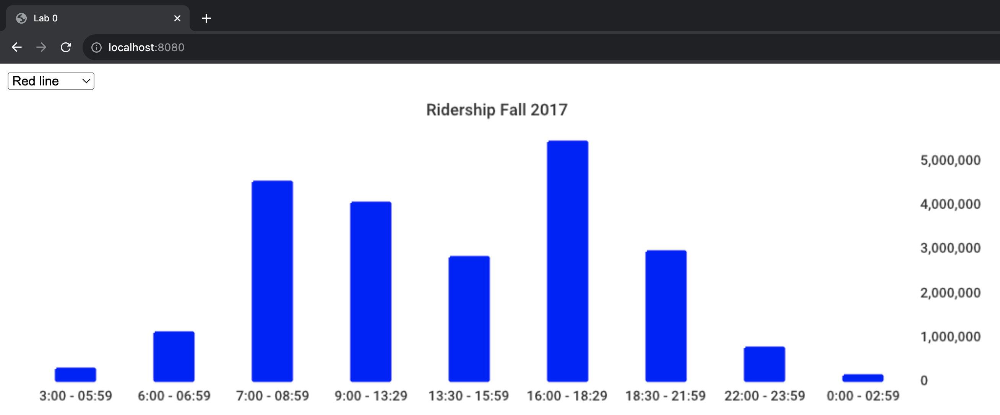

# Lab 0: Go tutorial

In this tutorial, we will briefly go over the most important concepts of the Go programming language. You will create a dashboard application visualizing data of the Massachusetts Bay Transportation Authority (MBTA). The main goal of the lab and the linked tutorials is to have you play around with Go --- familiarizing yourself with the covered concepts will come in handy for future labs! :)

## Installation

1. Follow [these instructions](https://go.dev/doc/install) to install Go.

 2. We recommend using VisualStudio Code to work on the labs. VisualStudio Code can be downloaded [from here](https://code.visualstudio.com/download). After installation, make sure to add Go extensions and tools: Open VS Code, open the extension manager by pressing `Ctrl + Shift + x`, type "go" into the search bar and hit enter, find the Go extension by the GO team at Google and install it, open the command palette by pressing `Ctrl + Shift + p`, run `Go: Install/Update Tools`, select all tools and click ok.

 3. Clone this github repository: In a directory of your choice, run `git clone https://github.com/MIT-DB-Class/lab0`.

 4. [Download the database file](https://www.dropbox.com/s/37k6lrqd9uq52aa/mbta.sqlite?dl=1) `mbta.sqlite` and place it in the `lab0` directory (where `main.go` is).

 5. You should be all set! You can run the code  by typing `go run main.go` in your terminal from the `lab0` directory or clicking on "Run and Debug" in VS Code (on the very left, click on the icon with the bug and the triangle and then on "Run and Debug").

## Lab and Go walk through

In the following, we walk you through the lab and want to point your attention towards some Go features. After the installation, the structure of your project should look as follows:

```
 .
 ├─ handlers/
 | ├─ handlers_test.go
 │ ├─ handlers.go
 | └─ template.html
 ├─ ridership_db/
 | ├─ csv_ridership_db.go
 │ ├─ interface_ridership_db.go
 | ├─ ridership_db_test.go
 | └─ sqlite_ridership_db.go
 ├─ utils/
 │ └─ render_chart.go
 ├─ main.go
 ├─ mbta.csv
 ├─ mbta.sqlite  # TODO: download using link above
 ├─ go.mod
 ├─ go.sum
 └─ README.md
```

### Hello world

In this lab you will implement a simple http server that visualizes ridership data from Boston's MBTA metro system. Go provides many tutorials with small sample applications that are a great way to play around with features of the language. For example, [this tutorial](https://go.dev/tour/basics/1) gives an introduction on Go's basic syntax, from structuring your files to writing a "Hello world" program.

Please use the linked tutorials and documentation to familiarize yourself with the Go language, which we will use for all labs in this course. The tutorials and documentation linked in this lab should allow you to fill out the missing functions required for the web app.

Please look at [this documentation](https://pkg.go.dev/net/http#hdr-Servers) for an overview on how http servers are created in Go.


### Error handling

Open `ridership_db/sqlite_ridership_db.go`. In line 14, we connect to a Sqlite database. This may fail because of various reasons, for example if the database file `mbta.sqlite` is not present. Go has a built-in `error` type which is used for error handling, and many methods in Go will return an error in addition to their normal return value.  This is unlike the use of exceptions for error handling in Python and Java. [This tutorial](https://go.dev/doc/tutorial/handle-errors) discusses error handling in Go in more detail.


### Control flow
You've seen `if` statements when handling errors. `ridership_db/sqlite_ridership_db.go` also implements a very simple iteration logic. In line 33, we run a query against sqlite which returns `rows`, a pointer to the result set. In lines 40-47, we use the `next` and `scan` methods of `rows` to iterate through the result set and add the returned rows to a slice ("a list"). Both slices and pointers are explained in the next subsection --- for now, focus on familiarizing yourself with Go's control flow syntax.

Check out [this tutorial](https://go.dev/tour/flowcontrol/1) to make yourself familiar with control flow in Go.

### Pointers, structs, slices and maps

Now,  go to `ridership_db/csv_ridership_db.go` and look at lines 10 to 15. You can see how we define the `CsvRidershipDB` struct (like we have previously defined the `SqliteRidershipDB` struct).

Note that when defining the struct, the asterisks ("\*") in lines 12 and 13 declare that `csvFile` is a *pointer* to an `os.File` and `csvReader` is a *pointer* to a `csv.Reader`. These pointer variables are used to store the memory addresses where the actual `os.File` and `csv.Reader` reside in memory.
The main use of pointers in Go is to "pass by reference" -- if a function takes a  pointer argument and makes a change to the passed value, that value will also be seen by the caller (similarly if a function returns a pointer argument, the returned value may be changed by the caller).  If the "\*" is omitted, this is "pass by value";  pass-by-value arguments to functions receive a copy of the value, and thus any changes made to them will be made on a copy and not seen by the caller.

In line 11, you can see how we define a *map*, which is Go's analog to a Python dictionary or a C++ unordered_map.
You will have to implement the `GetRidershipMethod` for `CsvRidershipDB`, which returns an int64 *slice* (`[]int64`) and an error.  Slices are Go's analog to a Python list or a C++ vector. Note that slices and maps are always passed by reference in Go.

Look at [this tutorial](https://go.dev/tour/moretypes/1) to make yourself familiar with pointers, structs, slices and maps. If you want additional material on pointers, have a look at [this tutorial](https://www.geeksforgeeks.org/pointers-in-golang/?ref=lbp).


### Methods and interfaces

Both the `SqliteRidershipDB` type and the `CsvRidershipDB` type implement the `RidershipDB` interface, which is defined in `ridership_db/interface_ridership_db.go`. A type implements an interface by implementing all of its methods.  Note that this is usually implicit -- nowhere do we explicitly indicate that the two ridership types implement `RidershipDB`. Interfaces allow us to simply use the `RidershipDB` type in lines 23-24 in `handlers.go`, without needing to distinguish which of the two implementations we are using (`SqliteRidershipDB` or `CsvRidershipDB`).

[This tutorial](https://go.dev/tour/methods/1) gives more detail on methods and interfaces.

### It doesn't stop here

The above resources provide a very brief overview of the most important features of the Go language. However, there are many more resources online as Go has a large and supportive community. We strongly encourage you to explore these resources and gain more experience with Go. If you find any tutorials particularly useful, please send them to us! :) 65830-staff [at] mit [dot] edu


## The Assignment

Complete the following two tasks for this lab:

### 1. Start an http server and handle requests

This task requires you to start up the http server in `main.go` and handle the user's GET requests by filling out the `HomeHandler` method in `handlers/handlers.go`.

The final web app looks like in the screenshot below, where users can select a T line (e.g. red line) and display its ridership statistics in a bar chart. The `HomeHandler` function first checks which line the user has selected in the drop down menu and then queries ridership numbers for that line from a `RiderhipDB` instance. The returned values are then displayed in a bar chart. You don't need to write code to plot the bar chart yourself, you can simply use the `GenerateBarChart` function in `utils/render_chart.go`.

After completing this task, you should be able to start the web server by running `go run main.go` and see the web app in your browser by going to http://localhost:PORT (where PORT is the port number you specified):



You should also be able to pass the test in `handlers_test.go`: When running `go test` from the `handlers` directory, you should get a similar output to this:

```
PASS
ok  	main/handlers	0.246s
```

### 2. Run a query over a CSV file

This task requires you to implement the missing methods in `ridership_db/csv_ridership_db.go`

Instead of issuing the query against sqlite, `CsvRidershipDB` directly runs it over the `mbta.csv` CSV file. MBTA divides a day into nine different time periods (*time_period_01*, ..., *time_period_09*). The CSV file contains how many passengers boarded trains during a specific time period, at a specific station and for a specific line and direction. For the queried line (passed to `GetRidership`) compute the total number of passengers that boarded a train for each given time period (for each time period, sum over all stations and directions). The sum for each time period should be an entry in the returned `int64` slice. Make sure to use the `idIdxMap` map to map the time period id strings (e.g. *time_period_01*) to the correct index in the `boardings` slice (e.g. 0).

To use your CSV implementation in the web app, instantiate RidershipDB to be a `CsvRidershipDB` instead of a `SqliteRidershipDB` in lines 23-24 in `handlers/handlers.go`:

```
// instantiate ridershipDB
// var  db rdb.RidershipDB =  &rdb.SqliteRidershipDB{} // Sqlite implementation
var db rdb.RidershipDB = &rdb.CsvRidershipDB{} // CSV implementation
```

You should also be able to pass the tests in `ridership_db/ridership_db_test.go`: When running `go test` from the `ridership_db` directory, you should get a similar output to this:

```
=== RUN   TestRidershipDBsMatch
=== RUN   TestRidershipDBsMatch/red
--- PASS: TestRidershipDBsMatch/red (0.00s)
=== RUN   TestRidershipDBsMatch/green
--- PASS: TestRidershipDBsMatch/green (0.00s)
=== RUN   TestRidershipDBsMatch/blue
--- PASS: TestRidershipDBsMatch/blue (0.00s)
=== RUN   TestRidershipDBsMatch/orange
--- PASS: TestRidershipDBsMatch/orange (0.00s)
--- PASS: TestRidershipDBsMatch (0.01s)
PASS
ok      main/ridership_db       0.226s
```

## Submission

50% of the grade is determined by an autograder, which checks if your code passes the test cases. The remaining 50% comes from us inspecting your code.

To submit your code, please do the following:

1. In the `lab0` directory, run `zip -r submission.zip handlers utils ridership_db main.go`.

2. Submit the generated zip to [the autograder](https://www.gradescope.com/courses/583077/assignments/3263816/).

3. The autograder should give you a score, based on whether your code passes the test cases. We will release the remaining 50% of the grade later.
